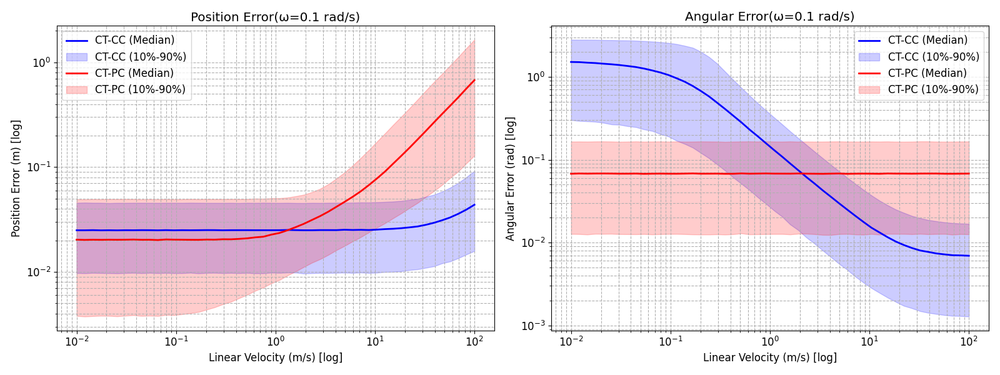
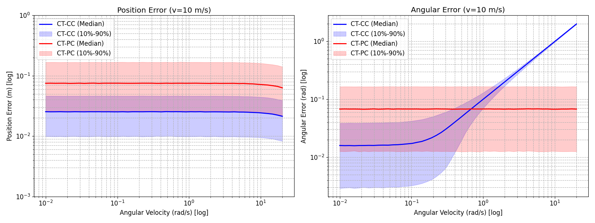
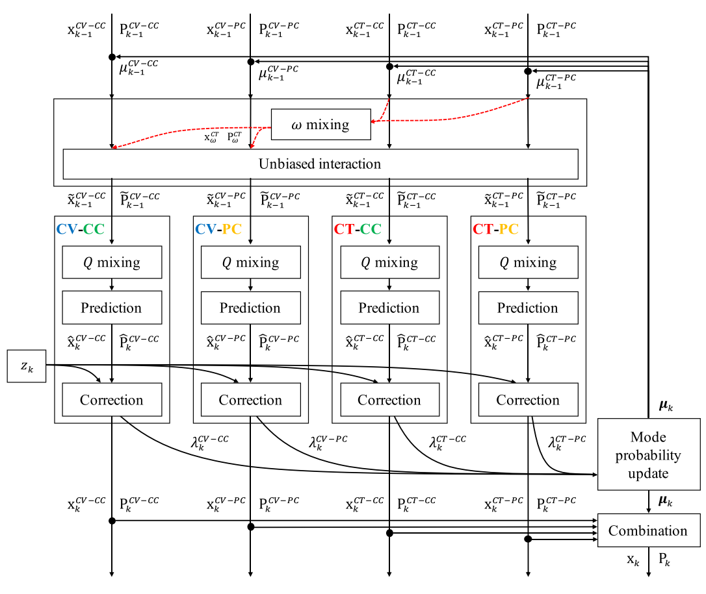
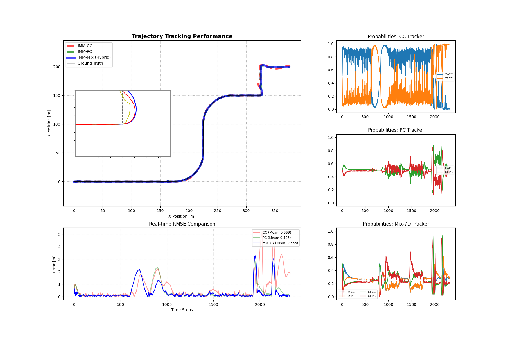
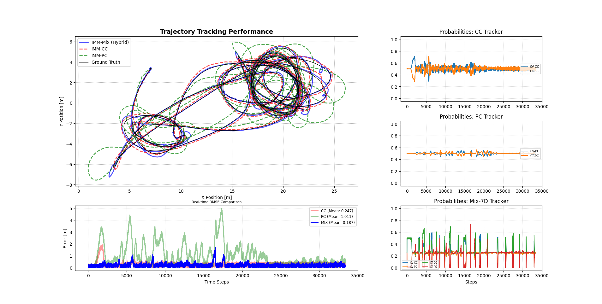

## 符号定义

- 待跟踪目标的位置在笛卡尔坐标系中表示为 $x$ 和 $y$，它的方位角 $\theta$ 是与水平 $X-axis$ 轴的夹角 
- 待跟踪目标的速度矢量 $v$ 在笛卡尔坐标系中的分量表示为两个标量 $(\dot{x},\dot{y})$
  - $\dot{x}=v \cdot cos\theta$
  - $\dot{y}=v\cdot sin\theta$
- 角速度 $\omega=\dot{\theta}$，相对坐标轴旋转时 $\omega$ 为正
- 状态向量表示为 $\mathrm{x}$ ，状态转移的时间差为 $T$ ，状态向量的协方差矩阵为 $P$
- 状态转移方程和观测方程如下(通常定义 $\mathrm{z}=[x,y]^T$ )
  - $\mathrm{x}_k=f(\mathrm{x}_{k-1},\mathrm{u}_k)$
  - $\mathrm{z}_k=h(\mathrm{x}_k)$

## 运动模型

运动模型主要根据两个维度进行分类：

- **运动假设 (Motion Assumptions)**：区分目标是保持**恒定速度 (Constant Velocity, CV)** 还是进行**协调转弯 (Coordinated Turn, CT)**。
- **速度表示 (Velocity Representation)**：区分速度是定义在**笛卡尔坐标系 (Cartesian Coordinates, CC)** 还是**极坐标系 (Polar Coordinates, PC)**。

#### **需要注意的地方**

**极坐标系 (Polar Coordinates, PC)** 使用 $\sigma_{\dot{v}}^2$ 和  $\sigma_{\dot{\omega}}^2$ ，速度使用标量 $v$​ 表示，其与 **笛卡尔坐标系 (Cartesian Coordinates, CC)** 的关联性为 

- $\dot{x}=v \cdot cos\theta$
- $\dot{y}=v\cdot sin\theta$

**笛卡尔坐标系 (Cartesian Coordinates, CC)** 在非完整约束下运动时，模型的运动方向可以通过 $\theta=\tan^{-1}\frac{\dot{y}}{\dot{x}}$ 瞬时导出；其速度通常表示为 $[\dot{x},\dot{y}]^T$

**协调转弯 (Coordinated Turn, CT)**运动模型在零角速度( $\omega=0$ )的情况下退化，因此通常在接近零角速度的情况下使用 **恒定速度 (Constant Velocity, CV)** 模型（然而，没有一个通用的规则或阈值来确定将CT模型切换到CV模型的近零值）

## 运动模型分析
下表详细对比了四种基础运动模型在运动假设、状态定义、转移函数和噪声模型等方面的关键特性。

| 特性              | CV-CC                                                        | CV-PC                                                        | CT-CC                                                        | CT-PC                                                        |
| ----------------- | ------------------------------------------------------------ | ------------------------------------------------------------ | ------------------------------------------------------------ | ------------------------------------------------------------ |
| 运动假设      | 恒定速度                                                     | 恒定速度                                                     | 协调转弯                                                     | 协调转弯                                                     |
| 速度坐标      | 笛卡尔坐标                                                   | 极坐标                                                       | 笛卡尔坐标                                                   | 极坐标                                                       |
| 状态变量      | $\mathrm{x}=[x,y,\dot{x},\dot{y}]^T$                         | $\mathrm{x}=[x,y,\theta,v]^⊤$                                | $\mathrm{x}=[x,y,\dot{x},\dot{y},\omega]^⊤$                  | $\mathrm{x}=[x,y,\theta,v,\omega]^⊤$                         |
| 转移函数 f(x) | $\left[\begin{array}{c}x + \dot{x}T \\ y + \dot{y}T \\ \dot{x} \\ \dot{y}\end{array}\right]$ | $\left[\begin{array}{c}x + \dot{x}T \\ y + \dot{y}T \\ \dot{x} \\ \dot{y}\end{array}\right]$ | $\left[\begin{array}{c}x + \frac{\dot{x}}{\omega}\sin(\omega T) - \frac{\dot{y}}{\omega}(1-\cos(\omega T)) \\ y + \frac{\dot{y}}{\omega}\sin(\omega T) + \frac{\dot{x}}{\omega}(1-\cos(\omega T)) \\ \dot{x}\cos(\omega T) - \dot{y}\sin(\omega T) \\ \dot{x}\sin(\omega T) + \dot{y}\cos(\omega T) \\ \omega\end{array}\right]$ | $\left[\begin{array}{c}x + \frac{2v}{\omega}\sin\left(\frac{\omega T}{2}\right)\cos\left(\theta + \frac{\omega T}{2}\right) \\ y + \frac{2v}{\omega}\sin\left(\frac{\omega T}{2}\right)\sin\left(\theta + \frac{\omega T}{2}\right) \\ \theta + \omega T \\ v \\ \omega\end{array}\right]$ |
| 转移噪声 $Q = G\Sigma G^{\top}$ | -    | -    | -    | -    |
| 噪声雅可比矩阵 $G$ | $\left[\begin{array}{cc}\frac{T^2}{2} & 0 \\ 0 & \frac{T^2}{2} \\ T & 0 \\ 0 & T\end{array}\right]$ | $\left[\begin{array}{cc}\frac{T^2}{2}\cos\theta & 0 \\ \frac{T^2}{2}\sin\theta & 0 \\ 0 & \frac{T^2}{2} \\ T & 0 \\ 0 & T\end{array}\right]$ | $\left[\begin{array}{ccc}\frac{T^2}{2} & 0 & 0 \\ 0 & \frac{T^2}{2} & 0 \\ T & 0 & 0 \\ 0 & T & 0 \\ 0 & 0 & T\end{array}\right]$ | $\left[\begin{array}{cc}\frac{T^2}{2}\cos\theta & 0 \\ \frac{T^2}{2}\sin\theta & 0 \\ 0 & \frac{T^2}{2} \\ T & 0 \\ 0 & T\end{array}\right]$ |
| 噪声协方差 $\Sigma$ | $\Sigma = diag(\sigma_{\ddot{x}}^2, \sigma_{\ddot{y}}^2)$ | $\Sigma = diag(\sigma_{\dot{v}}^2, \sigma_{\dot{\omega}}^2)$ | $\Sigma = diag(\sigma_{\ddot{x}}^2, \sigma_{\ddot{y}}^2, \sigma_{\dot{\omega}}^2)$ | $\Sigma = diag(\sigma_{\dot{v}}^2, \sigma_{\dot{\omega}}^2)$ |

为了可视化运动模型的不确定性传播，对 `CT-CC` 和 `CT-PC` 模型进行了蒙特卡罗实验。

在实验中，从初始状态( $\theta=π/4rad$ )开始，对线速度( $0\sim 100m/S$)和角速度(从 $0.01rad/S$ 到 $20rad/S$ )进行了 `100000` 次状态预测。

其标准差分别为 $\sigma_{\theta}=0.1rad$，$\sigma_{v}=0.3m/S$，$\sigma_{\omega}=0.1rad/S$，$T=0.1s$。

- 实验一：固定 **角速度 $\omega=0.1rad/s$** ，线速度由 $0\sim 100m/S$ 均匀变化，计算 `CT-CC` 和 `CT-PC` 模型的位置误差和方位角误差的中位数及其 $10\%$ 到 $90\%$ 的误差带(横纵坐标均采用对数刻度)

  将  $0\sim 100m/S$ 在 `log` 曲线上均分为 $100$ 份，每次循环注入的原始信息为 $(v,w=0.1)$

  - 对于 `CT-PC` 模型，需要注入 

    $$
    \begin{align}
    \theta_{noise} &= \theta_0+\mathcal{N}(0,\sigma_{\theta}^2)\\
    v_{noise} &= v_0 +\mathcal{N}(0,\sigma_{v}^2)\\
    \omega_{noise} &= \omega_0 +\mathcal{N}(0,\sigma_{\omega}^2)
    \end{align}
    $$

    根据传递函数计算预测状态 $\mathrm{x}_{pre}$ 理想状态向量为由 $(\theta_0,v_0,\omega_0)$ 注入后得到 $\mathrm{x}_{real}$ 由此计算中位数及方差等统计信息。

  - 对于 `CT-CC` 模型，需要注入

    $$
    \begin{align}
    \dot{x}_{noise} &= v_0\cdot cos\theta+\mathcal{N}(0,(\sigma_{v}\cdot cos\theta)^2)\\
    \dot{y}_{noise} &= v_0\cdot sin\theta+\mathcal{N}(0,(\sigma_{v}\cdot sin\theta)^2)\\
    \omega_{noise} &= \omega_0 +\mathcal{N}(0,\sigma_{\omega}^2)
    \end{align}
    $$

​		根据传递函数计算预测状态 $\mathrm{x}_{pre}$ 理想状态向量为由 $(v_0\cdot cos\theta,v_0\cdot sin\theta,\omega_0)$ 注入后得到 $\mathrm{x}_{real}$ 由此计算中位数及方差等统计信息。

> 本研究通过对笛卡尔坐标系（`CC`）与极坐标系（`PC`）下的协调转弯（`CT`）模型进行深入对比，揭示了状态空间定义对运动模型不确定性传播的影响。虽然两类模型在理想运动学公式上具有数学等价性，但其噪声传播特性在不同速域下表现出显著差异。实验一的蒙特卡罗结果表明，`CT-CC` 模型在低速区域存在明显的方位角奇异性，由于其航向角隐式地通过速度分量导出，在速度矢量模长趋于零时，微小的加性噪声会导致航向估计发生爆发式发散，表现出严重的数值不稳定性。相比之下，`CT-PC` 模型实现了线速度与方位角的解耦，其航向误差在全速域内保持恒定，不随线速度的降低而退化。在位置预测方面，虽然两类模型的中值误差随速度增加呈线性增长且基本重合，但 CT-PC 模型定义的切向与法向噪声更符合受非完整约束目标的物理特性。综上所述，极坐标表示法在目标起步、低速机动或航向敏感型跟踪任务中具有更强的鲁棒性，而笛卡尔坐标系则在高速稳定行驶场景下更具计算简洁性，这一结论为多模型跟踪算法（如 `IMM`）中的模型切换与坐标系选择提供了重要的理论依据。

- 实验二：固定 **线速度 $v=10m/s$** ，角速度由 $0.01rad/S$ 到 $20rad/S$ 均匀变化，计算 `CT-CC` 和 `CT-PC` 模型的位置误差和方位角误差的中位数及其 $10\%$ 到 $90\%$ 的误差带(横纵坐标均采用对数刻度)
  - `CT-CC` 模型注入的是 $\dot{x},\dot{y},\omega$ 及其噪声，$\dot{x},\dot{y}$ 噪声协方差和 $v$ 相同，因为符合非完整约束
  - `CT-PC` 模型注入的是 $v,w$ 及其噪声

  将  $0\sim 20rad/S$ 在 `log` 曲线上均分为 $100$ 份，每次循环注入的原始信息为 $(v=10,w)$

  - 对于 `CT-PC` 模型，需要注入 

    $$
    \begin{align}
    \theta_{noise} &= \theta_0+\mathcal{N}(0,\sigma_{\theta}^2)\\
    v_{noise} &= v_0 +\mathcal{N}(0,\sigma_{v}^2)\\
    \omega_{noise} &= \omega_0 +\mathcal{N}(0,\sigma_{\omega}^2)
    \end{align}
    $$

    根据传递函数计算预测状态 $\mathrm{x}_{pre}$ 理想状态向量为由 $(\theta_0,v_0,\omega_0)$ 注入后得到 $\mathrm{x}_{real}$ 由此计算中位数及方差等统计信息。

  - 对于 `CT-CC` 模型，需要注入

    $$
    \begin{align}
    \theta_{samle} &= \theta_0+\mathcal{N}(0,\sigma_{\theta}^2)\\
    v_{sample} &= v_0 +\mathcal{N}(0,\sigma_{v}^2)\\
    \dot{x}_{noise} &= v_{sample}\cdot cos\theta_{sample}\\
    \dot{y}_{noise} &= v_{sample}\cdot sin\theta_{sample}\\
    \omega_{noise} &= \omega_0 +\mathcal{N}(0,\sigma_{\omega}^2)
    \end{align}
    $$
  
  

​		根据传递函数计算预测状态 $\mathrm{x}_{pre}$ 理想状态向量为由 $(v_0\cdot cos\theta,v_0\cdot sin\theta,\omega_0)$ 注入后得到 $\mathrm{x}_{real}$ 由此计算中位数及方差等统计信息。

> 实验二结果显示，固定线速度 $10m/s$ 时，`CT-CC` 和 `CT-PC` 模型的位置误差与方位角误差随角速度变化呈现不同特征，低角速度区间 `CT-PC` 模型位置误差更优，高角速度下 `CT-CC` 模型在方位角误差上表现更稳定，两种模型的误差分布通过对数刻度可清晰观察到互补性，整体误差均控制在较小范围，符合目标跟踪的实际应用需求。

从上面的分析中，我们观察到，具有相同运动假设但不同速度表示的运动模型在不同的线速度和角速度的运动条件下具有不同的精度(以平均值表示)和不确定性(以10%和90%表示)。我们对具有不同速度表示的运动模型的观察促使我们关注针对不同运动类型的运动模型，例如从慢到快的速度和从平滑到急转弯。

## 带状态扩增的 `IMM-UKF` 跟踪

无迹卡尔曼滤波（ `Unscented Kalman Filter, UKF`）作为处理非线性系统的高效工具，能够通过 `sigma` 点采样精准近似状态的概率分布，相比扩展卡尔曼滤波（`EKF`）显著提升非线性运动模型的估计精度。因此，本章提出 “带状态扩充的 `IMM-UKF` 跟踪方法”，核心目标是：在 `UKF` 提供精准非线性估计的基础上，通过无偏状态扩充策略，解决异维度运动模型的交互融合问题，实现对兼具直线与转弯运动特征的目标的稳定、高精度跟踪。

| State Variables Modes       | `IMM-AUG-CC` $\mathrm{x}=[x,y,\dot{x},\dot{y},\omega]^T$     |                                                              | `IMM-AUG-PC` $\mathrm{x}=[x,y,\theta,v,\omega]^T$            |                                                              |
| :-------------------------- | :----------------------------------------------------------- | :----------------------------------------------------------- | :----------------------------------------------------------- | :----------------------------------------------------------- |
|                             | `CV-CC`                                                      | `CT-CC`                                                      | `CV-PC`                                                      | `CT-PC`                                                      |
| Transition Functions $f(x)$ | $\begin{bmatrix}x+\dot{x}T\\y+\dot{y}T\\ \dot{x}\\ \dot{y}\\0\end{bmatrix}$ | $\begin{bmatrix} x+\frac{\dot{x}}{\omega} \sin \left(\frac{\omega T}{2}\right)-\frac{\dot{y}}{\omega}(1-\cos (\omega T))\\ y+\frac{\dot{y}}{\omega} \sin(\frac{\omega T}{2})+\frac{\dot{x}}{\omega}(1-\cos(\omega T))\\ \dot{x} \cos (\omega T)-\dot{y} \sin (\omega T)\\ \dot{x} \sin(\omega T)+\dot{y} \cos (\omega T)\\ \omega\end{bmatrix}$ | $\begin{bmatrix}x+v T \cos \theta\\ y+v T \sin \theta\\ \theta\\ v \\0 \end{bmatrix}$ | $\begin{bmatrix} x+\frac{2 v}{\omega} \sin\left(\frac{\omega T}{2}\right) \cos\left(\theta+\frac{\omega T}{2}\right)\\ y+\frac{2v}{\omega} \sin \left(\frac{\omega T}{2}\right) \sin \left(\theta+\frac{\omega T}{2}\right)\\ \theta+\omega T\\ v\\ \omega\end{bmatrix}$ |
| Noise Jacobian $G$          | $\begin{bmatrix}\frac{T^2}{2} & 0 \\ 0 & \frac{T^2}{2} \\ T & 0 \\ 0 & T \\ 0 & 0\end{bmatrix}$ | $\begin{bmatrix}\frac{T^2}{2} & 0 & 0 \\ 0 & \frac{T^2}{2} & 0 \\ T & 0 & 0 \\ 0 & T & 0 \\ 0 & 0 & T\end{bmatrix}$ | $\begin{bmatrix}\frac{T^2}{2}\cos\theta & 0 \\ \frac{T^2}{2}\sin\theta & 0 \\ 0 & \frac{T^2}{2} \\ T & 0 \\ 0 & T\end{bmatrix}$ | $\begin{bmatrix}\frac{T^2}{2}\cos\theta & 0 \\ \frac{T^2}{2}\sin\theta & 0 \\ 0 & \frac{T^2}{2} \\ T & 0 \\ 0 & T\end{bmatrix}$ |
| Noise Covariance            | $\Sigma=\text{diag}\left(\sigma_{\ddot{x}}^{2}, \sigma_{\ddot{y}}^{2}\right)$ | $\Sigma=\text{diag}(\sigma_{\ddot{x}}^{2}, \sigma_{\ddot{y}}^{2}, \sigma_{\dot{\omega}}^{2})$ | $\Sigma=\text{diag}\left(\sigma_{\dot{v}}^{2}, \sigma_{\dot{\omega}}^{2}\right)$ | $\Sigma=\text{diag}\left(\sigma_{\dot{v}}^{2}, \sigma_{\dot{\omega}}^{2}\right)$ |

### 状态异质性问题的数学表征 

- `CV` 模型（低维模型）的状态向量为 $\boldsymbol{x}^{\text{CV}} = [x, y, \dot{x}, \dot{y}]^\top$（维度 $4 \times 1$），协方差矩阵为 $\boldsymbol{P}^{\text{CV}} \in \mathbb{R}^{4 \times 4}$；

- `CT` 模型（高维模型）的状态向量为 $\boldsymbol{x}^{\text{CT}} = [x, y, \dot{x}, \dot{y}, \omega]^\top$（维度 $5 \times 1$），协方差矩阵为 $\boldsymbol{P}^{\text{CT}} \in \mathbb{R}^{5 \times 5}$;

其中 $\omega$ 为角速度状态。 传统 `IMM` 的模型交互步骤要求所有模型基于统一维度的状态空间进行混合估计，而 `CV` 模型缺失角速度  $\omega$  对应的状态分量与协方差信息，直接融合将导致估计偏差或数值不稳定。因此，状态扩充的核心是通过无偏策略，为低维模型补充缺失的状态信息，构建统一维度的状态空间 $\mathrm{x} = [x, y, \dot{x}, \dot{y}, \omega]^\top$（维度 $5 \times 1$）。 

### 无偏状态扩充策略

为避免扩充过程引入系统性偏差，采用基于高维模型的无偏扩充方法，具体实现如下： 

1. **状态分量扩充**：低维 `CV` 模型的缺失状态 $\omega$ 直接取自高维 `CT` 模型的角速度估计值，即 $\omega^{\text{CV}} = \omega^{\text{CT}}$。这一设计的合理性在于，`CT` 模型的角速度状态经过`UKF` 迭代优化，能够准确反映目标的转向特征，为 `CV` 模型提供可靠的补充信息。
2. **协方差矩阵适配**：`CV` 模型的协方差矩阵需扩展为与 `CT` 模型一致的维度，扩充后的协方差矩阵定义为： 

$$
\begin{align}
\mathrm{x}^{CT}&=
\begin{bmatrix}
\mathbf{x}_{\omega^{c}}^{CT}\\
\mathbf{x}_{\omega}^{CT}
\end{bmatrix},\quad 
\mathrm{P}^{CT}&=
\begin{bmatrix}
\mathbf{P}_{\omega^{c}\omega^{c}}^{CT} & \mathbf{P}_{\omega^{c}\omega}^{\mathrm{CT}}\\
\mathbf{P}_{\omega\omega^{c}}^{CT}     & \mathbf{P}_{\omega\omega}^{CT}
\end{bmatrix}\\
\mathrm{x}^{CV}&=
\begin{bmatrix}
\mathbf{x}_{\omega^{c}}^{\mathrm{CV}}\\
\mathbf{x}_{\omega}^{\mathrm{CT}}
\end{bmatrix},\quad 
\mathrm{P}^{\mathrm{CV}}&=
\begin{bmatrix}
\mathbf{P}_{\omega^{c}\omega^{c}}^{\mathrm{CV}} & 0\\
0 & \mathbf{P}_{\omega\omega}^{\mathrm{CT}}
\end{bmatrix}
\end{align}
$$

其中：

-  $\mathrm{x}^{CT}$ 和 $\mathrm{P}^{CT}$ 是 `CT` 模式的状态和协方差
- $\mathrm{x}^{CV}$ 和 $\mathrm{P}^{CV}$ 是 `CV` 模式的状态和协方差
- $\mathrm{x}_{\omega^c}=[x,y,\dot{x},\dot{y}]^T(IMM-AUG-CC)$,  $\mathrm{x}_{\omega^c}=[x,y,\theta,v]^T(IMM-AUG-PC)$指的是 $\omega$ 以外的状态变量

`CT` 模型的混合初始状态 
$$
\begin{align}
\tilde{\boldsymbol{x}}^{\text{CT}} &= \mu_{\text{CV|CT}} \boldsymbol{x}^{\text{CV}} + \mu_{\text{CT|CT}} \boldsymbol{x}^{\text{CT}}\\
\tilde{P}^{CT} &= \mu_{CV|CT} \left( P^{CV} + \delta^{CV} \cdot \delta^{CV^\top} \right) + \mu_{CT|CT} \left( P^{CT} + \delta^{CT} \cdot \delta^{CT^\top} \right)\\
\delta^{CV} &= x^{CV} - \tilde{x}^{CT}\\
\delta^{CT} &= x^{CT} - \tilde{x}^{CT}
\end{align}
$$

其中：

- $\mu_{\text{CV|CT}}$ 为`CT` 模型转移到 `CV` 模型的混合概率，$\mu_{CT|CT}$ 为 `CT` 模型继续保持 `CT` 模型的概率。

当CT模型的混合概率 $\mu_{CT|CT}$ 接近0时（即目标当前近似匀速运动，`CT`模型权重极低），$\mathbf{P}_{\omega\omega}^{CT}$ 会趋近于0，导致协方差矩阵近乎奇异（数值不稳定）。此时需给 $\mathbf{P}_{\omega\omega}^{CT}$ 设定一个极小的正定值（如 $10^{-6}$），确保协方差矩阵正定，避免计算崩溃。

## 基于交互异质运动模型的自适应跟踪

### 异质速度表示的状态混合IMM-UKF跟踪

状态维度统一：两类 `IMM` 变体的模型对状态维度一致（均为同维度，无角速度ω的差异）：

- `IMM-CV-MIX`：融合 `CV-CC`（笛卡尔+匀速，4维）与CV-PC（极坐标+匀速，4维）；

- `IMM-CT-MIX`：融合 `CT-CC`（笛卡尔+转弯，5维）与CT-PC（极坐标+转弯，5维）。

**核心矛盾：**两种速度表示的模型在不同场景下各有优势（如PC模型适配平滑转弯，CC模型适配突变运动），但传统方法通过“坐标转换”融合（如均转为笛卡尔坐标）会引入系统偏差，破坏模型互补性。

为了将具有不同速度表示的运动模型应用于 `IMM`，我们设计了用于混合两个 `CV` 模型( `CV-CC` 和 `CV-PC` )的 `IMM-CV-Mix` 和用于混合两个 `CT` 模型( `CT-CC` 和 `CT-PC` )的 `IMM-CT-Mix` ，如下表所示

| 状态变量与模式           | `IMM-CV-MIX` $x=[x\ y\ \theta\ v\ \dot{x}\ \dot{y}]^{\top}$  |                                                              | `IMM-CT-MIX` $x=[x\ y\ \theta\ v\ \dot{x}\ \dot{y}\ \omega]^{\top}$ |                                                              |
| ------------------------ | ------------------------------------------------------------ | ------------------------------------------------------------ | ------------------------------------------------------------ | ------------------------------------------------------------ |
| 模式                     | `CV-CC`                                                      | `CV-PC`                                                      | `CT-CC`                                                      | `CT-PC`                                                      |
| 转移函数 \(f(x)\)        | $$ \begin{bmatrix} x+\dot{x}T \\ y+\dot{y}T \\ \tan^{-1}\left(\frac{\dot{y}}{\dot{x}}\right) \\ \sqrt{\dot{x}^2+\dot{y}^2} \\ \dot{x} \\ \dot{y} \end{bmatrix} $$ | $$\begin{bmatrix} x+vT\cos\theta \\ y+vT\sin\theta \\ \theta \\ v \\ v\cos\theta \\ v\sin\theta \end{bmatrix} $$ | $$\begin{bmatrix} x+\frac{\dot{x}}{\omega}\sin(\omega T) - \frac{\dot{y}}{\omega}(1-\cos(\omega T)) \\ y+\frac{\dot{x}}{\omega}(1-\cos(\omega T)) + \frac{\dot{y}}{\omega}\sin(\omega T) \\ \tan^{-1}\left(\frac{\dot{x}\sin(\omega T)+\dot{y}\cos(\omega T)}{\dot{x}\cos(\omega T)-\dot{y}\sin(\omega T)}\right) \\ \sqrt{\dot{x}^2+\dot{y}^2} \\ \dot{x}\cos(\omega T) - \dot{y}\sin(\omega T) \\ \dot{x}\sin(\omega T) + \dot{y}\cos(\omega T) \\ \omega \end{bmatrix} $$ | $$ \begin{bmatrix} x+\frac{2v}{\omega}\sin\left(\frac{\omega T}{2}\right)\cos\left(\theta+\frac{\omega T}{2}\right) \\ y+\frac{2v}{\omega}\sin\left(\frac{\omega T}{2}\right)\sin\left(\theta+\frac{\omega T}{2}\right) \\ \theta+\omega T \\ v \\ v\cos(\theta+\omega T) \\ v\sin(\theta+\omega T) \\ \omega \end{bmatrix} $$ |
| 噪声雅各比 \(G\)         | $$ \begin{bmatrix}0 & 0 & \frac{T^2}{2} & 0 \\0 & 0 & 0 & \frac{T^2}{2} \\0 & \frac{T^2}{2} & 0 & 0 \\T & 0 & 0 & 0 \\0 & 0 & T & 0 \\0 & 0 & 0 & T\end{bmatrix} $$ | $$\begin{bmatrix}\frac{T^2}{2}\cos\theta & 0 & 0 & 0 \\\frac{T^2}{2}\sin\theta & 0 & 0 & 0 \\0 & \frac{T^2}{2} & 0 & 0 \\T & 0 & 0 & 0 \\0 & 0 & T & 0 \\0 & 0 & 0 & T\end{bmatrix}$$ | $$ \begin{bmatrix}0 & 0 & \frac{T^2}{2} & 0 & 0 \\0 & 0 & 0 & \frac{T^2}{2} & 0 \\0 & 0 & T & 0 & 0 \\0 & 0 & 0 & T & 0 \\0 & \frac{T^2}{2} & 0 & 0 & 0 \\T & 0 & 0 & 0 & 0 \\0 & 0 & 0 & 0 & T\end{bmatrix} $$ | $$ \begin{bmatrix}\frac{T^2}{2} \cos\theta & 0 & 0 & 0 \\ \frac{T^2}{2} \sin\theta & 0 & 0 & 0 \\0 & \frac{T^2}{2} & 0 & 0 \\T & 0 & 0 & 0 \\0 & 0 & T & 0 \\0 & 0 & 0 & T \\0 & T & 0 & 0\end{bmatrix}$$ |
| 混合噪声协方差 $ \Sigma$ | $$ \begin{bmatrix} \tilde{\Sigma}_{\dot{v}\dot{\omega}} & 0_{2\times2} \\ 0_{2\times2} & \Sigma_{\ddot{x}\ddot{y}} \end{bmatrix} $$ | $$ \begin{bmatrix} \Sigma_{\dot{v}\dot{\omega}} & 0_{2\times2} \\ 0_{2\times2} & \tilde{\Sigma}_{\ddot{x}\ddot{y}} \end{bmatrix} $$ | $$ \begin{bmatrix} \tilde{\Sigma}_{\dot{v}\dot{\omega}} & 0_{2\times2} & 0_{2\times1} \\ 0_{2\times2} & \Sigma_{\ddot{x}\ddot{y}} & 0_{2\times1} \\ 0_{1\times2} & 0_{1\times2} & \sigma_{\omega}^2 \end{bmatrix} $$ | $$ \begin{bmatrix} \Sigma_{\dot{v}\dot{\omega}} & 0_{2\times2} \\ 0_{2\times2} & \tilde{\Sigma}_{\ddot{x}\ddot{y}} \end{bmatrix} $$ |

#### Q混合

-  笛卡尔噪声→极坐标混合噪声：$\tilde{\Sigma}_{\dot{v}\dot{\omega}} = J_{CP} \Sigma_{\ddot{x}\ddot{y}} J_{CP}^\top$

- 极坐标噪声→笛卡尔混合噪声：$\tilde{\Sigma}_{\ddot{x}\ddot{y}} = J_{PC} \Sigma_{\dot{v}\dot{\omega}} J_{PC}^\top$

- 笛卡尔→极坐标转换矩阵 $J_{CP}$（将笛卡尔加速度噪声转换为极坐标速度/角速度噪声）：

$$
J_{CP} = \begin{bmatrix} \frac{\dot{x}}{\sqrt{\dot{x}^2+\dot{y}^2}} & \frac{\dot{y}}{\sqrt{\dot{x}^2+\dot{y}^2}} \\ \frac{-\dot{y}}{\dot{x}^2+\dot{y}^2} & \frac{\dot{x}}{\dot{x}^2+\dot{y}^2} \end{bmatrix}
$$

- 极坐标→笛卡尔转换矩阵 $J_{PC}$（将极坐标速度/角速度噪声转换为笛卡尔加速度噪声）：

$$
J_{PC} = \begin{bmatrix} \cos\theta & -v\sin\theta \\ \sin\theta & v\cos\theta \end{bmatrix}
$$

其中：

- $\Sigma_{\ddot{x}\ddot{y}} = diag(\sigma_{\ddot{x}}^2, \sigma_{\ddot{y}}^2)$：CC模型原始加速度噪声协方差；
- $\Sigma_{\dot{v}\dot{\omega}} = diag(\sigma_{\dot{v}}^2, \sigma_{\dot{\omega}}^2)$：PC模型原始速度/角速度噪声协方差；
- $\tilde{\Sigma}$：Q混合后的无偏噪声协方差（用于状态预测）;

##### 遵循 IMM+UKF 的核心逻辑，整合冗余状态与 Q 混合，流程如下：

1. **交互步骤**：基于混合概率 $\mu_{j|i}$，加权融合两类模型（如CV-CC与CV-PC）的上一时刻状态/协方差，生成混合状态 $\tilde{x}$ 与混合协方差 $\tilde{P}$（无额外转换，直接基于冗余状态融合）；
2. **预测步骤**：通过Q混合生成无偏噪声协方差 $\tilde{\Sigma}$ ，输入UKF进行sigma点采样与非线性状态预测（利用各模型的转移函数）；
3. **校正步骤**：结合观测值 $z=[x,y]^\top$ ，通过UKF观测更新，得到各模型校正后的状态/协方差；
4. **组合步骤**：更新模式概率，加权融合两类模型的校正结果，统一输出笛卡尔坐标表示的最终跟踪状态（通过$\psi_{PC}$ 转换函数将极坐标速度映射为笛卡尔速度，确保输出一致性）。

| 状态变量与模式 | `IMM-AUG-MIX` $x=[x\ y\ \theta\ v\  \dot{x}\ \dot{y}\ \omega]^{\top}$ | | | |
| --- | --- | --- | --- | --- |
| 模式 | `CV-CC` | `CV-PC` | `CT-CC` | `CT-PC` |
| 转移函数 \(f(x)\) | $ \begin{bmatrix} x+\dot{x}T \\ y+\dot{y}T \\ \tan^{-1}\left(\frac{\dot{y}}{\dot{x}}\right) \\ \sqrt{\dot{x}^2+\dot{y}^2} \\ \dot{x} \\ \dot{y} \\ 0 \end{bmatrix} $ | $\begin{bmatrix} x+vT\cos\theta \\ y+vT\sin\theta \\ \theta \\ v \\ v\cos\theta \\ v\sin\theta \\ 0 \end{bmatrix} $ | $\begin{bmatrix} x+\frac{\dot{x}}{\omega}\sin(\omega T) - \frac{\dot{y}}{\omega}(1-\cos(\omega T)) \\ y+\frac{\dot{x}}{\omega}(1-\cos(\omega T)) + \frac{\dot{y}}{\omega}\sin(\omega T) \\ \tan^{-1}\left(\frac{\dot{x}\sin(\omega T)+\dot{y}\cos(\omega T)}{\dot{x}\cos(\omega T)-\dot{y}\sin(\omega T)}\right) \\ \sqrt{\dot{x}^2+\dot{y}^2} \\ \dot{x}\cos(\omega T) - \dot{y}\sin(\omega T) \\ \dot{x}\sin(\omega T) + \dot{y}\cos(\omega T) \\ \omega \end{bmatrix} $ | $ \begin{bmatrix} x+\frac{2v}{\omega}\sin\left(\frac{\omega T}{2}\right)\cos\left(\theta+\frac{\omega T}{2}\right) \\ y+\frac{2v}{\omega}\sin\left(\frac{\omega T}{2}\right)\sin\left(\theta+\frac{\omega T}{2}\right) \\ \theta+\omega T \\ v \\ v\cos(\theta+\omega T) \\ v\sin(\theta+\omega T) \\ \omega \end{bmatrix} $ |
| 噪声雅可比 \(G\) | $  \begin{bmatrix}0 & \frac{T^2}{2} & 0 & 0 \\0 & 0 & \frac{T^2}{2} & 0 \\0 & 0 & 0 & \frac{T^2}{2} \\T & 0 & 0 & 0 \\0 & T & 0 & 0 \\0 & 0 & T & 0\\ 0 & 0 & 0 & 0\end{bmatrix}  $ | $\begin{bmatrix}\frac{T^2}{2}\cos\theta & 0 & 0 & 0 \\\frac{T^2}{2}\sin\theta & 0 & 0 & 0 \\0 & 0 & 0 & \frac{T^2}{2} \\T & 0 & 0 & 0 \\Tcos\theta & 0 & 0 & 0 \\Tsin\theta & 0 & 0 & 0\\ 0 & 0 & 0 & 0 \end{bmatrix}$ | $ \begin{bmatrix}0 & \frac{T^2}{2} & 0 & 0 & 0 \\0 & 0 & \frac{T^2}{2} & 0 & 0 \\0 & 0 & 0 & T & 0 \\T & 0 & 0 & 0 & 0 \\0 & T & 0 & 0 & 0 \\0 & 0 & T & 0 & 0 \\0 & 0 & 0 & 0 & T\end{bmatrix} $ | $ \begin{bmatrix}\frac{T^2}{2} \cos\theta & 0 & 0 & 0 & 0\\ \frac{T^2}{2} \sin\theta & 0 & 0 & 0 & 0\\0 & 0 & 0 & T & 0 \\T & 0 & 0 & 0 & 0\\Tcos\theta & 0 & 0 & 0 & 0\\Tsin\theta & 0 & 0 & 0 & 0\\0 & 0 & 0 & 0 & T\end{bmatrix}$ |
| 混合噪声协方差 $\Sigma$ | $ \tilde{\Sigma} = \begin{bmatrix} \tilde{\Sigma}_{\dot{v}\dot{\omega}} & 0_{2\times2} \\ 0_{2\times2} & \Sigma_{\ddot{x}\ddot{y}} \end{bmatrix} $ | $\tilde{\Sigma} = \begin{bmatrix} \Sigma_{\dot{v}\dot{\omega}} & 0_{2\times2} \\ 0_{2\times2} & \tilde{\Sigma}_{\ddot{x}\ddot{y}} \end{bmatrix} $ | $\tilde{\Sigma} = \begin{bmatrix} \tilde{\Sigma}_{\dot{v}\dot{\omega}} & 0_{2\times2} & 0_{2\times1} \\ 0_{2\times2} & \Sigma_{\ddot{x}\ddot{y}} & 0_{2\times1} \\ 0_{1\times2} & 0_{1\times2} & \sigma_{\omega}^2 \end{bmatrix} $ | $\tilde{\Sigma} = \begin{bmatrix} \tilde{\Sigma}_{\dot{v}\dot{\omega}} & 0_{2\times2} & 0_{2\times1} \\ 0_{2\times2} & \Sigma_{\ddot{x}\ddot{y}} & 0_{2\times1} \\ 0_{1\times2} & 0_{1\times2} & \sigma_{\omega}^2 \end{bmatrix} $ |

### 异质运动模型的全面无偏融合

传统跟踪方法中，单一运动模型（如匀速模型 CV、协调转弯模型 CT）难以适配所有运动场景，而交互多模型（IMM）算法通过融合多个模型的优势，成为平衡估计精度与计算开销的主流方案。然而，现有 IMM 变体存在显著局限：仅能单独处理状态维度异质（如 CV 模型无角速度状态、CT 模型含角速度状态）或速度表示异质（笛卡尔坐标 $[\dot{x},\dot{y}]$ 、极坐标 $[\theta,v]$），无法实现两类异质性的同时无偏融合，导致模型互补性不足，难以应对复杂动态场景。

### $\omega$ 混合

CV模型的缺失角速度状态 $\omega$ ，由两类CT模型（CT-CC、CT-PC）的状态估计结果动态加权生成，而非主观赋予固定值，确保增广过程无偏且数值稳定。

1. 角速度状态均值和协方差的计算：

$$
\begin{align}
\mathrm{x}_{i,\omega}^{CT} &= \frac{\sum_{j \in M^{CT}} \mu_{j|i} \mathrm{x}_\omega^j}{\sum_{j \in M^{CT}} \mu_{j|i}}\\
P_{i,\omega\omega}^{CT} &= \frac{\sum_{j \in M^{CT}} \mu_{j|i} P_{\omega\omega}^j}{\sum_{j \in M^{CT}} \mu_{j|i}}
\end{align}
$$

其中 $M^{CT}=\{CT-CC,CT-PC\}$ 为CT模型集合，$\mu_{j|i}$ 为混合概率，表示 $M^{CT}$ 中第 $i$ 个模型转移到第 $j$ 个模型的概率。

2. CT 模型混合状态与协方差：

$$
\begin{align}
\tilde{x}^{CT} = \sum_{p \in M^{CV}} \mu_{p|i} x_p^{CV} + \sum_{q \in M^{CT}} \mu_{q|i} x_q^{CT}\\
\tilde{P}^{CT} = \sum_{p \in M^{CV}} \mu_{p|i} \left(P_p^{CV} + \delta_p^{CV} \delta_p^{CV\top}\right) + \sum_{q \in M^{CT}} \mu_{q|i} \left(P_q^{CT} + \delta_q^{CT} \delta_q^{CT\top}\right)
\end{align}
$$

其中 $\mu_{p|i}$ 表示第 $i$ 个 CT 模型转移到第 $p$ 个 CV 模型的概率， $\mu_{q|i}$ 表示第 $i$ 个 CT 模型转移到第 $q$ 个 CT 模型的概率，此外
$$
\begin{align}
x^{CV}_q &= \begin{bmatrix} x_{p,\omega^c}^{CV} \\ x_{i,\omega}^{CT} \end{bmatrix}, \quad P^{CV}_q = \begin{bmatrix} P_{p,\omega^c\omega^c}^{CV} & 0_{4\times1} \\ 0_{1\times4} & P_{i,\omega\omega}^{CT} \end{bmatrix}\\
x^{CT}_q &= \begin{bmatrix} x_{q,\omega^c}^{CT} \\ x_{q,\omega}^{CT} \end{bmatrix}, \quad P^{CT}_q = \begin{bmatrix} P_{q,\omega^c\omega^c}^{CT} & P_{q,\omega^c\omega}^{CT} \\ P_{q,\omega\omega^c}^{CT} & P_{q,\omega\omega}^{CT} \end{bmatrix}\\
\delta_p^{CV}&=x_p^{CV}-\tilde{x}^{CT}_p \quad \delta_q^{CT}=x_q^{CT}-\tilde{x}^{CT}_q
\end{align}
$$

### 合成数据集实验

该实验的核心在于模拟目标意图的多次剧烈转变。轨迹生成起始于长达 30 秒的匀速直线运动（CV 段），旨在建立滤波器的稳态增益并校准基础位置误差。随后进入的“Stop-and-Go”阶段是实验的第一处关键压力点：目标在 5 秒内迅速减速至静止，保持 5 秒完全静止后再次在 5 秒内加速至初始速度。这一阶段专门用于测试算法在低速及零速度点（Singularity Point）附近的数值稳定性。对于依赖极坐标的 PC 模型而言，当速度 趋近于零时，航向角 的雅可比矩阵会变得极不稳定，而异构的 Mix-7D 模型则需利用其笛卡尔速度分量 来补偿这种极坐标系下的数学奇异性。紧随其后的机动性能测试由两类性质不同的转弯组成。首先是具有物理连贯性的协同转弯段（CT 段），目标分别以 的角速度完成 的圆弧轨迹。这一段落主要考察子模型对向心加速度的拟合能力。实验真正的“压力高峰”出现在 Sharp-turns 段：目标在单个采样周期内发生 的航向角突变。这种非连续的运动改变在现实中对应于急转弯或碰撞反弹，它会导致预测残差（Residuals）瞬间激增。在此时，IMM 算法内部的交互机制必须在极短时间内（通常要求 3-5 个周期内）完成从 CV 模型到 CT 模型，或从 Cartesian 模型到 Polar 模型的权重重分配。实验结果如下图

### UZH-FPV无人机竞速数据集实验

在 UZH-FPV 无人机竞速数据集 的实验中，研究背景设定于极高动态的飞行环境。与普通的城市车辆或行人跟踪不同，该数据集记录了专业竞速无人机在狭窄赛道中的飞行轨迹，其特点是极高的线速度与频繁的瞬时大角速度转向。由于传感器（如板载相机或外部定位系统）在高速移动下会产生显著的观测噪声，且无人机频繁的姿态切换导致运动模式在直线冲刺与急转弯之间剧烈跳变，这为传统跟踪算法带来了巨大的模型失配挑战。

在具体分析中，实验重点考察了 IMM-AUG-MIX 算法对复杂轨迹的自适应捕获能力。当无人机进行高速直线飞行时，传统的极坐标模型（PC）往往因为对方向噪声敏感而产生轨迹抖动，而本文算法通过状态混合机制，能自动调高 CV-CC（笛卡尔坐标恒速）模型的权重以保持平滑性。一旦无人机进入高速弯道，角速度骤增，算法中的状态扩增技术能够让原本不含角速度项的 CV 模型与包含角速度项的 CT 模型实现无缝状态传递，确保在模型切换瞬间不会丢失跟踪目标。实验的参数配置仍与上一章节保持一致。实验结果如图 7。

