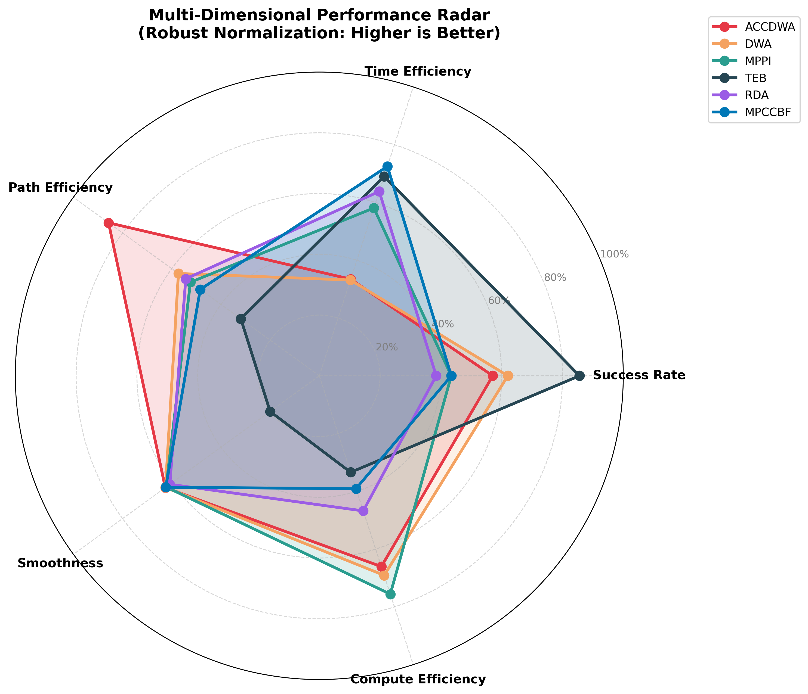
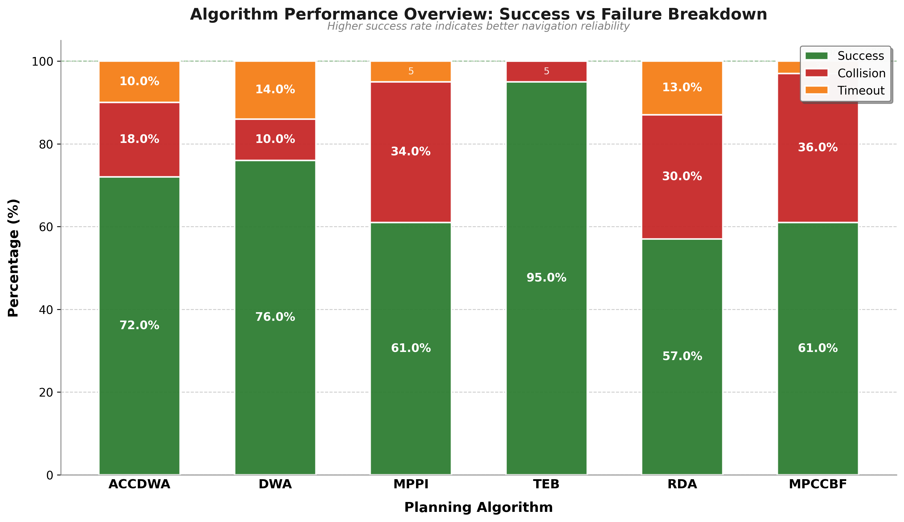
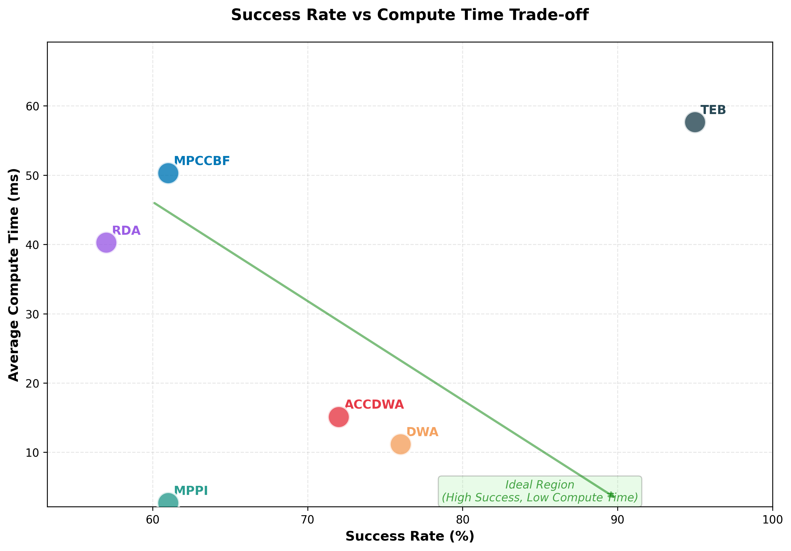

# 时空联合采样

内置以下几种 `base_line` 算法

```
├── AccDwaSolver.py
├── DwaplanSolver.py
├── MpcCbfSolver.py
├── MppiSolver.py
├── RdaSolver.py
├── TebSolver.pyc
```

## 运行方式

单个运行

```
cd SpatiotemporalJointSampling
python3 run.py
```

多种方法多次实验

```
cd SpatiotemporalJointSampling
python3 baseline_exp.py
```

## 评价指标计算

```
cd SpatiotemporalJointSampling
python3 utils/analyze_experiments.py 
```

输出 `.csv` 文件

| Algorithm | Total_Runs | Success_Rate | Collision_Rate | Timeout_Rate | Time_Mean  | Time_Var   | Length_Mean | Length_Var  | Smoothness_Mean | Smoothness_Var   | ComputeTime_Mean | ComputeTime_Var |
|-----------|------------|--------------|----------------|--------------|------------|------------|-------------|-------------|-----------------|------------------|------------------|-----------------|
| accdwa    | 100        | 0.7200       | 0.1800         | 0.1000       | 80.1014    | 46.8838    | 119.1253    | 2.1080      | 4.9255          | 3.6141           | 15.1164          | 1.0264          |
| dwa       | 100        | 0.7600       | 0.1000         | 0.1400       | 80.4263    | 58.7705    | 133.1797    | 98.4115     | 30.8245         | 4.7070           | 11.1624          | 0.3028          |
| mppi      | 100        | 0.6100       | 0.3400         | 0.0500       | 53.5639    | 166.4117   | 135.5898    | 56.4902     | 110.8360        | 1810.0874        | 2.6844           | 0.0081          |
| teb       | 100        | 0.9500       | 0.0500         | 0.0000       | 41.8116    | 47.3172    | 145.7327    | 446.4108    | 13648.9180       | 42075959.0048    | 57.6821          | 25.6589         |
| rda       | 100        | 0.5700       | 0.3000         | 0.1300       | 47.4000    | 27.6339    | 134.6536    | 27.4357     | 585.4365        | 12596.6158       | 40.2628          | 15.6590         |
| mpccbf    | 100        | 0.6100       | 0.3600         | 0.0300       | 38.0525    | 71.7265    | 137.5706    | 476.9684    | 66.4222         | 121.3896         | 50.2900          | 51.4322         |

## 结果图

```
cd SpatiotemporalJointSampling
python3 utils/draw_result.py
```

综合评价雷达图和导航指标堆叠柱状图

|||
| -- | -- |

综合评级散点图

